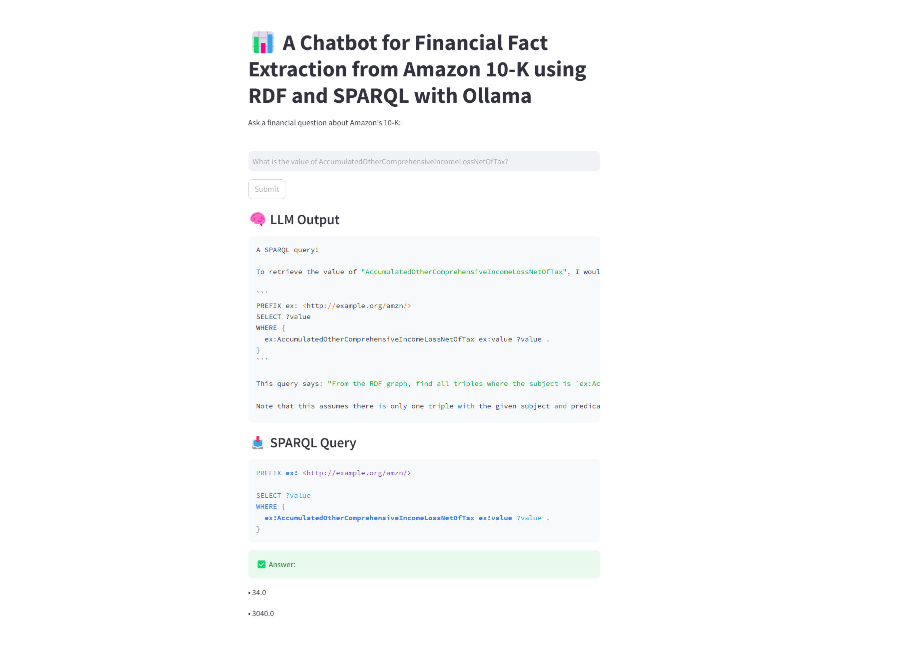

# 📊 LangLLaMA-FactQA: Financial Fact Extraction from Amazon 10-K Using RDF, SPARQL, LangChain, and LLaMA 3

> 🔍 Extract structured financial knowledge from SEC 10-K filings using RDF graphs, query them via SPARQL, and interface naturally using LLaMA 3 LLM through LangChain—all powered by Apache Jena Fuseki.

---

## 📽 Demo Video
[

---

## 🚀 Project Description
This project allows users to query financial data from Amazon's 10-K filing (XBRL to RDF) through a local LangChain+Ollama-powered chatbot.

- 🧠 Converts XBRL filings to RDF triples
- 🔎 Loads the `.ttl` (Turtle) file into a local Apache Jena Fuseki triplestore
- 🧾 Uses SPARQL queries dynamically generated by LLaMA 3 LLM
- 💬 Interface built using Streamlit for ease of access

---

## 🧱 Tech Stack Used

| Layer | Tools |
|-------|-------|
| LLM   | [Ollama](https://ollama.com/) with [LLaMA 3](https://ai.meta.com/llama/)
| Prompting | [LangChain](https://www.langchain.com/)
| Graph DB | [Apache Jena Fuseki](https://jena.apache.org/documentation/fuseki2/)
| File Conversion | [Arelle](https://arelle.org/) (for XBRL to RDF pipeline)
| UI | [Streamlit](https://streamlit.io/)
| RDF Format | Turtle (`.ttl`)
| Language | Python 3.10+
| Environment | Conda + Windows 11


---
## Demo


---
## 📁 Folder Structure
```
📂 LangLLaMA-FactQA/
├── amzn-2024.ttl               # Converted RDF Turtle file
├── xbrl_to_rdf.py              # Script to convert XBRL to RDF
├── sparql_query.py             # Basic SPARQL test script
├── main.py                     # LangChain + LLaMA SPARQL interface
├── app.py                      # Streamlit UI
├── requirements.txt            # Python dependencies
└── demo_screenshot.png         # UI screenshot preview
```

---

## 🛠 Setup Instructions

### 1. Clone & Setup Environment
```bash
git clone https://github.com/noorcs39/langllama-factqa
cd langllama-factqa
conda create -n ldm python=3.10
conda activate ldm
pip install -r requirements.txt
```

### 2. Run Apache Jena Fuseki
- Download and unzip [Apache Jena Fuseki](https://jena.apache.org/download/index.cgi)
- Run `fuseki-server` batch file
- Open `http://localhost:3030`
- Add dataset `/amzn`
- Upload `amzn-2024.ttl`

### 3. Pull LLaMA 3 and Test Ollama
```bash
ollama pull llama3
ollama run llama3
```

### 4. Launch Chatbot UI
```bash
streamlit run app.py
```

---

## 💡 Example Questions
- What is the value of AccountsPayableCurrent?
- How much is AccountsReceivableNetCurrent?
- Give me the value of AccruedLiabilitiesCurrent.

---

## 👤 Author
**Noor Uddin**  
📧 [noor.cs2@yahoo.com](mailto:noor.cs2@yahoo.com)  
🌐 [https://noorcs39.github.io/Nooruddin](https://noorcs39.github.io/Nooruddin)

---

## 📜 License
This project is licensed under the MIT License.

---

## 🙏 Acknowledgements
- SEC EDGAR for public 10-K filings
- Arelle for XBRL parsing
- LangChain & Ollama for powerful LLM pipelines
- Apache Jena for SPARQL and RDF storage
